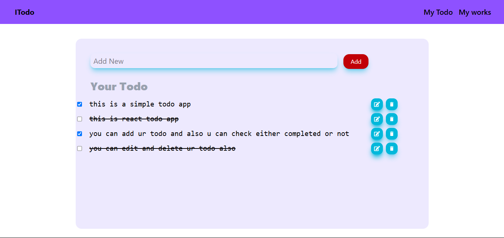

# To-Do App

A simple and stylish To-Do application built using React.

screenshot
----------
 


## Features

- Add new tasks
- Mark tasks as completed
- Delete tasks
- Responsive design for all devices

## Installation

1. Clone the repository:
   ```sh
   git clone https://github.com/Raju-kushwaha1230/React-Todo-App
   ```
2. Navigate to the project directory:
   ```sh
   cd React-Todo-App
   ```
   
3. Install dependencies:
   ```sh
   npm install
   ```
4. Start the development server:
   ```sh
   npm start 
   ```

## Technologies Used

- React.js
- HTML, CSS
- JavaScript

## Folder Structure

```
📂 todo-app
 ┣ 📂 src
 ┃ ┣ 📂 components
 ┃ ┃ ┣ 📜 TodoList.js
 ┃ ┃ ┣ 📜 TodoItem.js
 ┃ ┃ ┗ 📜 AddTask.js
 ┃ ┣ 📜 App.js
 ┃ ┗ 📜 index.js
 ┣ 📜 package.json
 ┣ 📜 README.md
 ┗ 📜 .gitignore
```

## Contributing

Feel free to fork this repository and submit pull requests for improvements!

##Raju kushwaha

